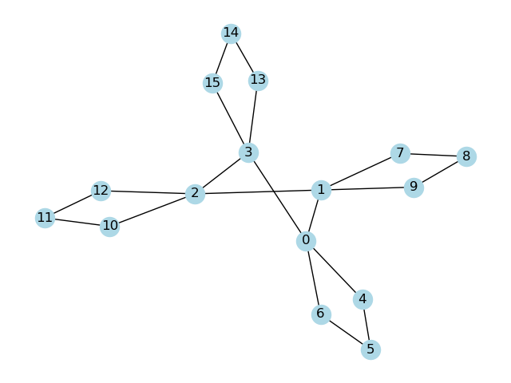

# max-independent-set

In graph theory, the ***Maximum Independent Set (MIS)*** of a graph $G = (V, E)$ is defined as the largest subset of vertices $I \subseteq V$ such that no two vertices in $I$ are adjacent. Formally, it satisfies the following conditions:

1. **Independence:** For any two vertices $(u, v) \in I$, there is no edge $(u, v) \in E$. That is, $\forall (u, v) \in I, (u, v) \notin E$.
2. **Maximality:** There is no other independent set $I'$ such that $I \subset I'$. That is, $I$ is not strictly a subset of any other independent set in $G$.

The goal is to find such a set $I$ with the maximum possible number of vertices.

## Linear Optimization Formulation
The *MIS* problem can be formulated as a linear optimization instance as follows:

### Decision Variables
Let $`x = \{x_i | x_i \in \{0, 1\}\}`$ be the set of binary decision variables for each vertex $i \in V$

The value of each $x_i$ is determined by its membership in $I$:
```math
x_i = \begin{cases} 1, i \in I \\ 0, i \notin I \end{cases}
```

### Constraints
```math
\forall (i, j) \in E, x_i + x_j \leq 1
```

For each edge, the sum of the decision variables of its vertices cannot exceed 1.

### Objective Function
```math
\max \left( \sum_{i \in V} x_i \right)
```

Maximize the sum of the decision variables; i.e., maximize the number of vertices in the set.


## Dependencies
- [`Gurobi`](https://www.gurobi.com/solutions/gurobi-optimizer/) & [`gurobipy`](https://pypi.org/project/gurobipy/) v10.0.3+
- [`pandas`](https://pypi.org/project/pandas/) v2.1.2+
- [`networkx`](https://networkx.org/) v3.2.1+

### Conda Installation
```bash
$ conda install -c gurobi gurobi
$ conda install -c conda-forge pandas
$ conda install networkx
```

### Obtaining a Gurobi License
To use the Gurobi Optimizer, a valid license is required. A guide to the available licenses can be found [here](https://support.gurobi.com/hc/en-us/articles/12684663118993-How-do-I-obtain-a-Gurobi-license).


## Initializing and Solving an *MIS* Instance

### Sample Run
```bash
$ python3 solve_mis.py
```

### Arguments
|Argument|Default|Description|
|--------|-------|-----------|
|`-n/--nodes_per_layer`|3|Number of nodes in each graph layer|
|`-l/--num_layers`|3|Number of uniform graph layers|
|`-m/--max_num_sol`|100|Maximum number of MIS solutions|
|`-e/--edges_filepath`|`None`|Filepath to existing edges file|

### Sample Output


## Visualizing an Unsolved Graph

### Sample Run
```bash
$ python3 draw_unsolved_graph.py -e samples/sample_edges.csv
```

### Arguments
|Argument|Description|
|--------|-----------|
|`-e/--edges_filepath`|Filepath to existing edges file|

### Sample Output
